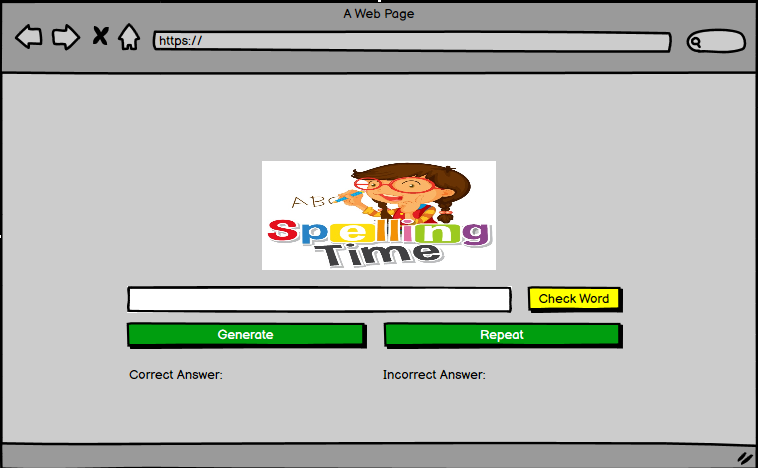

# SPELLING TIME

### Welcome to SPELLING TIME!!
![UI]

<!-- Introducttion about the site -->

## Table of Contents

- [Speling Time](#Spelling-Time)
  - [Table of Contents](#table-of-contents)
  - [**UX**](#ux)
    - [**Site Purpose**](#site-purpose)
    - [**Site Goal**](#site-goal)
    - [**Current User Goal**](#current-user-goal)
    - [**New User Goal**](#new-user-goal)
    - [**Communication**](#communication)
  - [**Design**](#design)
    - [**Wireframe**](#Balsamiq)
    - [**Colour Palette**](#colour-palette)
    - [**Typography**](#typography)
    - [**Images**](#images)
  - [**Features**](#features)
    - [**Language Used**](#language-used)
    - [**Navigation Bar**](#navigation-bar)
    - [**Landing Page**](#landing-page)
    - [**Footer**](#footer)
    - [**Future Features**](#future-features)
  - [**Testing**](#testing)
    - [**HTML Validatior Test**](#html-validatior-test)
    - [**CSS Validator Test**](#css-validator-test)
    - [**Lighthouse Mobile**](#lighthouse-mobile)
    - [**Libraries and Progransms used**](#libraries-and-progransms-used)
  - [**Deployment & Usage**](#deployment--usage)
    - [**Deployment**](#deployment)
  - [**Credits**](#credits)
    - [**Media**](#media)

## **UX**

### **Site Purpose**
    With the developement in technology we have seen a lot of improvements in our children when it comes to getting everything digitalize. Unfortunately there are also adheres effect on the advancement of technology and one of these are cutting corners and shortening how we properly speak or write to each other. It may help in some aspects like speeding up the process and communicating faster. However, using shortened and abreviating our words are affecting our knowledge to spell the words correctly and this has affected not only our todays youth but alot of us. 

#### What For: 
    This Web based game is to improve and develope my kids and other kids that will use my project to practice their spelling and vocabulary skills. 

#### Who For: 
    My target users are school age children who are in need to develope their spelling skills like my kids. 

### **Site Goal**
    - My goal is for this site to be the most useful web game to any user. 
    - At the moment the words in my project are embeded in my javascript but once I have done my Python course my goal is for the user to be able to input/edit/add words that they want to practice on. 

### **Current User Goal**
  - The words embeded in my java code ranges from easy to hard words which will give the user a bit of a challenge especially that I have randomize the words that are being generated in the game. 
  - I have made the simple so that there are less distruction to the user. I believe that if there are not a lot of things happening in a page the user is most likely to concentrate on spelling the word that has been generated. 
  - I also have added a fun logo to entice the user to use it.

### **Communication**
 English is the language that this site is supported 

## **Design**
  - I made the design as simple as possible to ommit distraction. While making this project, I have always taken into consideration my childs personality. He is easily distracted like any other kids so in order to lessen the interuption, I have made the design a little less distracting to the user. I initially thought of just a one page game, However, I thought of making it more personal to the user and added another page to give more information how to navigate through the game to provide more guide to users who need more support. 

### **Wireframe**
This is my Initial Plans without the 2 addtional pages, it is exactly how it looks like without the Index and the Help page .

### WEBPAGE VIEW
  ![Home Page]
  ![My Story Page]
  ![Visa Process Page]
  ![Documents Page]
  ![Contact Page]

### MOBILE VIEW
  ![MHome Page]
  ![MMy Story Page]
  ![MVisa Process Page]
  ![MDocuments Page]
  ![MContact Page]

 
### **Colour Palette**

### **Typography**
Playfair and Sans-Serif 

### **Images**
#### Home Page:

#### My Story Page:

#### Visa Process Page:

## **Features**
### NAVIGATION BAR ON ALL PAGES WITH ACTIVE HIGHLIGHT
  ![Nav Bar]

  
### SHORT DESCRIPTIVE TEXT ABOUT THE SITE AND PHOTO OF THE CONTENT CREATOR

  ![description]

### SOCIAL LINKS

  ![Social Links]

   

### CAROUSEL
    
  ![carousel]

  

### WORKING LINKS
  ![Working Links]

  

### VIDEO
  ![VIDEO]

### DOWNLOADABLE PDF LINK
  ![PDF LINK ]

  ### CONTACT PAGE 
  ![Contact Page]

  

### **Language Used**
 

### **Navigation Bar**

### **Landing Page**

### **Footer**

### **Future Features**

## **Testing**
### Bugs and Issues
  - ##### IDE issues
    

  - #### Code Issues
   
  - #### Path Issues 
    
  - #### Deployment Issues  

### **HTML Validatior Test**

### **CSS Validator Test**

### **Lighthouse Desktop/Mobile**

- I ran the lighthouse both in google chrome and incognito mode in mobile and as well desktop. 
The First time I ran it it gave me : 

  - 43% perfromance and 100% on accessibility, Best Practice and SEO for my home page.
  - 75% perfromance 100% on accessibility, Best Practice and SEO.
  - 56% perfomance 100% on accessibility, Best Practice and SEO.
  - 99% performance 100% on accessibility, Best Practice and SEO.
  - 100% performance 100% on accessibility, Best Practice and SEO.

   I read through the list of things that I could improve on. One of them is compressing my images from Home page and Visa Process page which I did, after compressing my image, uploading it and pushed it on Github. 
   
   I tried ruinning lighthouse again, it gave me :
   - 75% perfromance, 80%  accessibility, 100% Best Practice and 89% SEO.
   Unfortunately, I wasn't able to screenshot the above and could not remember the rest. I do not understand why it affected the accessiblity and the SEO. I was reading through it and it's citing my CDN's but I cannot delete my CDN's beause they are necessary for my bootstrap code. 

The mose confusing part after hours and hours finding a way for it to get a green, I finally gave up. Open my deployed site again the next day and is now giving me a different score. This part of testing took me 4 days 5 hrs each day and still could not understand, unfortunately its nearly time to submit my project and I will ready through about lighthouse in my own pace to understand how it works. At the moment, to be honest I have no clue what I am doing with lighthouse but it would be interesting to find out what I did wrong and what I can do to achieve full marks on this testing. 

### LIGHTHOUSE LASTMINUTE FIX 30-01-2024

## **Libraries and Programs used**

## **Deployment & Usage**
### **Deployment**
To deploy my site on Git Hub I made the following steps. I found out how to deploy my project when I was playing around with github trying to fix my incorrect path which hinders my images to load up on live. 

These are the steps:

 - Go to the Settings tab of your GitHub repo.
 - On the left-hand sidebar, in the Code and automation section, select Pages.
 - Make sure: Source is set to 'Deploy from Branch'.
 - Main branch is selected.
 - Folder is set to / (root).
 - Under Branch, click Save.
 - Go back to the Code tab. Wait a few minutes for the build to 
 - finish and refresh your repo.
 - On the right-hand side, in the Environments section, click on 'github-pages'.
 - Click View deployment to see the live site

### **Fork**
  1.  On GitHub.com, navigate to the Visa-Chronicles repository.
  2.  In the top-right corner of the page, click Fork.
  3.  Under "Owner," select the dropdown menu and click an owner for the forked repository.
  4.  By default, forks are named the same as their upstream repositories. Optionally, to further distinguish your fork, in the "Repository name" field, type a name.
  5.  Optionally, in the "Description" field, type a description of your fork.
  6.  Optionally, select Copy the DEFAULT branch only.
  7.  Click Create fork.

### **Cloning**
  1.  On GitHub.com, navigate to your fork of the Spoon-Knife repository.
  2.  Above the list of files, click  Code.
  3.  Copy the URL for the repository.
    - To clone the repository us
    itory using an SSH key, including a certificate issued by your organization's SSH certificate authority, click SSH, then click .
    - To clone a repository using GitHub CLI, click GitHub CLI, then click .
  4.  Open Git Bash.
  5.  Change the current working directory to the location where you want the cloned directory.
  6.  Type git clone, and then paste the URL you copied earlier. It will look like this, with your GitHub username instead of YOUR-USERNAME:
  7.  Press Enter. Your local clone will be created.

## **Credits**

### **Media**