# SPELLING TIME

### Welcome to SPELLING TIME!!
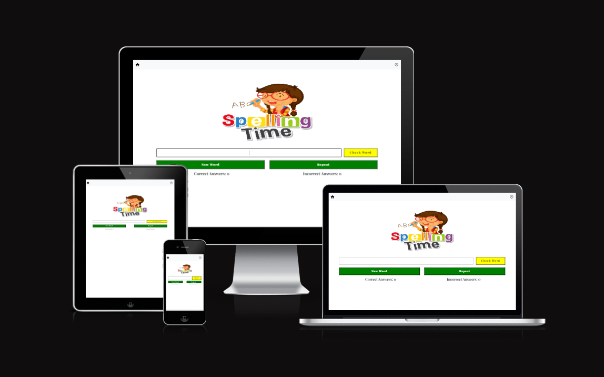

<!-- Introducttion about the site -->

## Table of Contents

- [Speling Time](#Spelling-Time)
  - [Table of Contents](#table-of-contents)
  - [**UX**](#ux)
    - [**Site Purpose**](#site-purpose)
    - [**Site Goal**](#site-goal)
    - [**Current User Goal**](#current-user-goal)
    - [**New User Goal**](#new-user-goal)
    - [**Communication**](#communication)
  - [**Design**](#design)
    - [**Wireframe**](#Wireframe)
    - [**Colour Palette**](#colour-palette)
    - [**Typography**](#typography)
    - [**Images**](#images)
  - [**Features**](#features)
    - [**Future Features**](#future-features)
  - [**Testing**](#testing)
    - [**HTML Validatior Test**](#html-validatior-test)
    - [**CSS Validator Test**](#css-validator-test)
    - [**Lighthouse**](#lighthouse)
    - [**Libraries and Progransms used**](#libraries-and-progransms-used)
  - [**Deployment & Usage**](#deployment--usage)
    - [**Deployment**](#deployment)
  - [**Credits**](#credits)
    - [**Media**](#media)

## **UX**

### **Site Purpose**
  With the developement in technology we have seen a lot of improvements in our children when it comes to getting everything digitalize. Unfortunately there are also adheres effect on the advancement of technology and one of these are cutting corners and shortening how we properly speak or write to each other. It may help in some aspects like speeding up the process and communicating faster. However, using shortened and abreviating our words are affecting our knowledge to spell the words correctly and this has affected not only our todays youth but alot of us. 

#### What For: 
  This Web based game is to improve and develope my kids and other kids that will use my project to practice their spelling and vocabulary skills. 

#### Who For: 
  My target users are school age children who are in need to develope their spelling skills like my kids. 

### **Site Goal**
  - My goal is for this site to be the most useful web game to any user. 
  - At the moment the words in my project are embeded in my javascript but once I have done my Python course my goal is for the user to be able to input/edit/add words that they want to practice on. 

### **Current User Goal**
  - The words embeded in my java code ranges from easy to hard words which will give the user a bit of a challenge especially that I have randomize the words that are being generated in the game. 
  - I have made the simple so that there are less distruction to the user. I believe that if there are not a lot of things happening in a page the user is most likely to concentrate on spelling the word that has been generated. 
  - I also have added a fun logo to entice the user to use it.

### **Communication**
 English is the language that this site is supported 

## **Design**
  - I made the design as simple as possible to omit distraction. While making this project, I have always taken into consideration my childs personality. He is easily distracted like any other kids so in order to lessen the interuption, I have made the design a little less distracting to the user. I initially thought of just a one page game, However, I thought of making it more personal to the user and added another page to give more information how to navigate through the game to provide more guide to users who need more support. 

### **Wireframe**

  - This is my Initial Plans without the 2 addtional pages, it is exactly how it looks like without the Index and the Help page .

  

 
### **Colour Palette**

### **Typography**
Playfair and Sans-Serif 

### **Images**
- Images that are used are within school age visual taste.

## **Features**
### NAVIGATION BAR ON ALL PAGES WITH ACTIVE HIGHLIGHT
  - Compared to my 1st milestone project, my game only has a few pages and this game is quite straight forward. To avoid confusion I made the game simple with a few features that could help users navigate the game easily. 

  - This button is in the Home page where the players are ask to key in their details and the number of words that they want to play.

  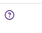

  - This navigation bar holds the Home button and the help button. I added the help button just in case they forgot instructions. However, once in the help page the only way to get back is by going back to the home button to reset the game. 

  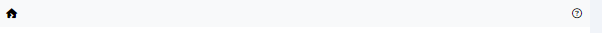

  - This button is the back button found in the help page which takes you back to the home page and restart the game. 

  

  - This is the help page, where user can read about the game and find instructions. The game itself is very straight forward this was made just in case there are user who need further help. 

  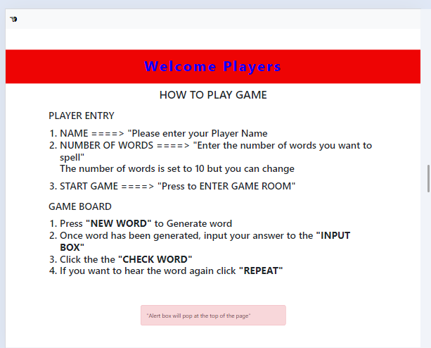

### **Future Features**

## **Testing**
### User Experience
  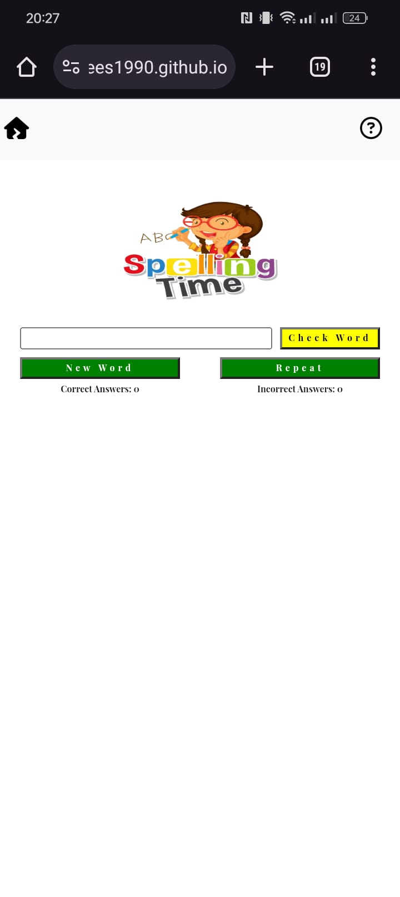 
  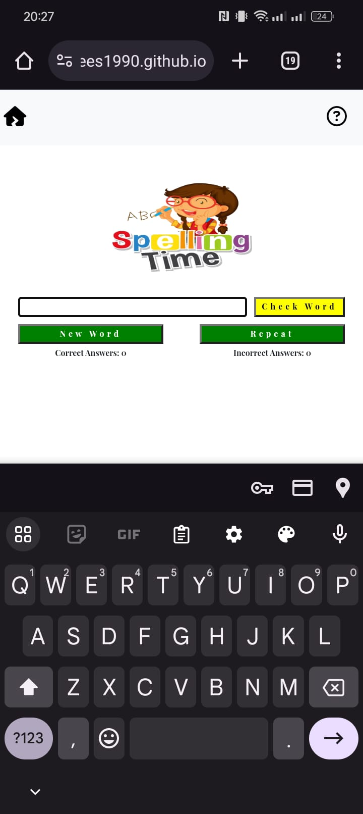
  
  - It look a little bit small when you use it in mobile view as you can see above. I wanted to move it in the middle but I thought once the input box is triggered the keypad shows up it limits the view forcing user to scroll down and up making it frustrating. So I left it on top visibility leaving room for the keypad for easier user experience. 

  Please see below screenshots of users that tested my game. 
  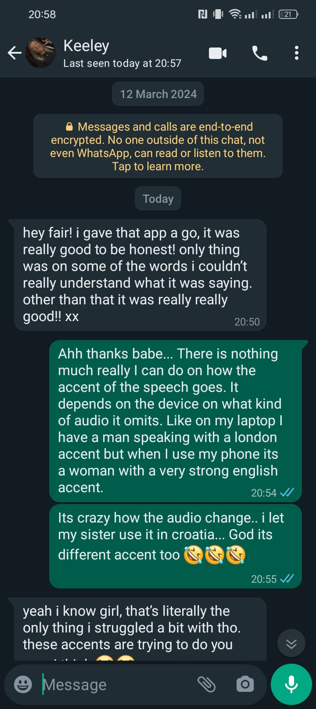 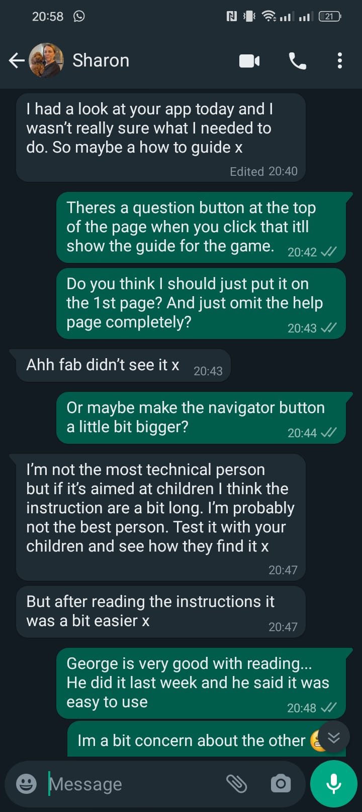
  
  Since the game is designed for children. I made my own kids try it out today 
      - George 9 years old tested at 17/04/24 3:50PM 
        - I's quite good mam but sometimes I do not understand what it is saying but it helps that there is a repeat button I can use to listen to it again. 
      - Gia 4 years old tested at 17/04/24 4PM
        - I like it, it looks pretty
        (She don't know how to spell the words obviously but she wanted to take part so I just let her test it and ask her input on how it looks)

### Bugs and Issues

  - #### Code Issues
    - Game Over / End Game alert does not show after you spell your last word and click the check word button, it only shows when you click the Generate button again which doesn't make sense for a user. So I tried moving the alert to the Entry fucntion button code however it wasn't working. I found out that it should be set to ===0 not === -1 as this one I tried first before moving the alerts geography. 

    - I wanted the alert to show the scores but I could't seem to make it work. I have researched about it, but for some reason I could not find any solution for what I wanted to do. I may have asked the wrong questions reason why I couldn't get anywhere but I somehow figured it out myself. I don't know if it is the right way but it somehow works. 

    - I wanted the cursor to stay in the input box using jquery but it didn't before because I placed it in the wrong place. I moved it now near the DOM event listener and other event listener for the other buttons. I thought you don't need it on the other button but it turns out you do as when I tested them without the jquery method the cursor do not stay put so I left all the jquery on all event listener buttons. 

    - alt was found on all my <a> tags which wasn't supposed to be there. Using w3c was able to track mistake and corrected it. 

  - #### User Experience Issues
    - The view on the mobile is quite tricky as It looks quite small. However you could always zoom it in. The reason why I made it fit length wise and on the top is because I wanted to keep some space in the buttom for when the keybox appears it does not eat up the space for the game forcing the user to scroll up and down which is kinda frustrating as a user. 
  
  - #### Path Issues
    - Images where in bad practice edited all the image path names as some of them have spaces. 

  - #### Deployment Issues
    -  Issue on Deployment, silly mistake that a noob like me does. I did not make an index page making my website untraceable/unloadable when deployed. When I had my meeting with my mentor only then I realized my mistake. This must have been mentioned during the HTML part of the course but clearly I might have forgotten or skipped that part. However, that mistake has opened an opportunity for me to make my website much more appealing. Making an index which is used to record the players info and set how many he words the user would want to do. Opening more opportunities to open another page to help guide users who needs further instructions. 

### **HTML Validatior Test**

### **CSS Validator Test**

### **Lighthouse Desktop**
  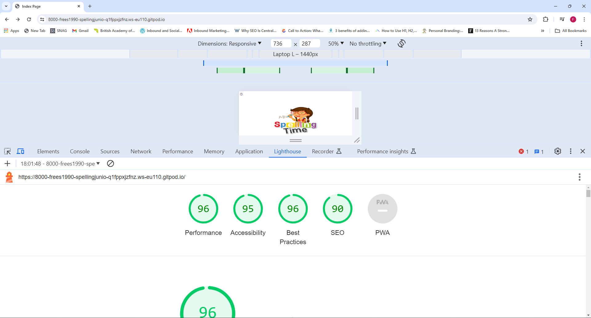
  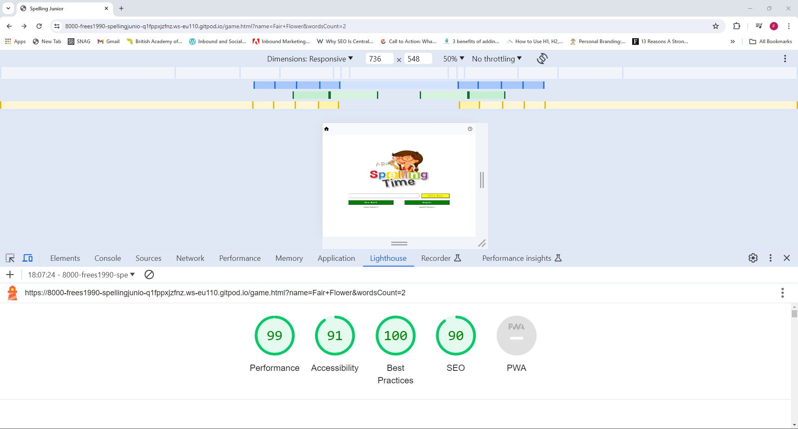
  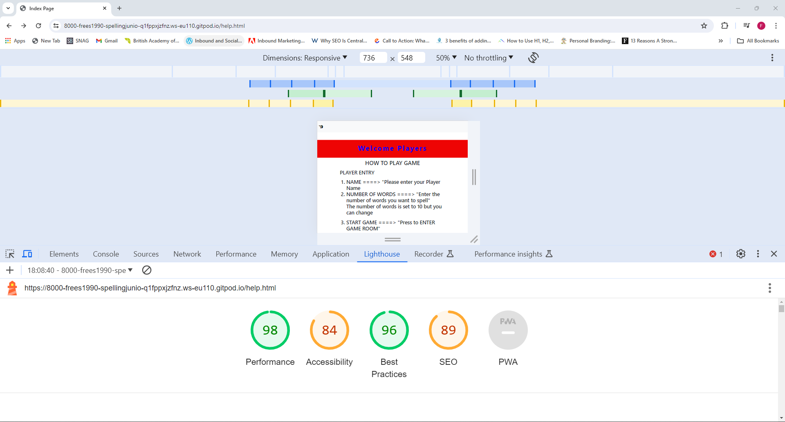

## **Libraries and Programs used**

## **Deployment & Usage**
### **Deployment**
To deploy my site on Git Hub I made the following steps. I found out how to deploy my project when I was playing around with github trying to fix my incorrect path which hinders my images to load up on live. 

These are the steps:

 - Go to the Settings tab of your GitHub repo.
 - On the left-hand sidebar, in the Code and automation section, select Pages.
 - Make sure: Source is set to 'Deploy from Branch'.
 - Main branch is selected.
 - Folder is set to / (root).
 - Under Branch, click Save.
 - Go back to the Code tab. Wait a few minutes for the build to 
 - finish and refresh your repo.
 - On the right-hand side, in the Environments section, click on 'github-pages'.
 - Click View deployment to see the live site

### **Fork**
  1.  On GitHub.com, navigate to the Visa-Chronicles repository.
  2.  In the top-right corner of the page, click Fork.
  3.  Under "Owner," select the dropdown menu and click an owner for the forked repository.
  4.  By default, forks are named the same as their upstream repositories. Optionally, to further distinguish your fork, in the "Repository name" field, type a name.
  5.  Optionally, in the "Description" field, type a description of your fork.
  6.  Optionally, select Copy the DEFAULT branch only.
  7.  Click Create fork.

### **Cloning**
  1.  On GitHub.com, navigate to your fork of the Spoon-Knife repository.
  2.  Above the list of files, click  Code.
  3.  Copy the URL for the repository.
    - To clone the repository us
    itory using an SSH key, including a certificate issued by your organization's SSH certificate authority, click SSH, then click .
    - To clone a repository using GitHub CLI, click GitHub CLI, then click .
  4.  Open Git Bash.
  5.  Change the current working directory to the location where you want the cloned directory.
  6.  Type git clone, and then paste the URL you copied earlier. It will look like this, with your GitHub username instead of YOUR-USERNAME:
  7.  Press Enter. Your local clone will be created.

## **Credits**

### **Media**